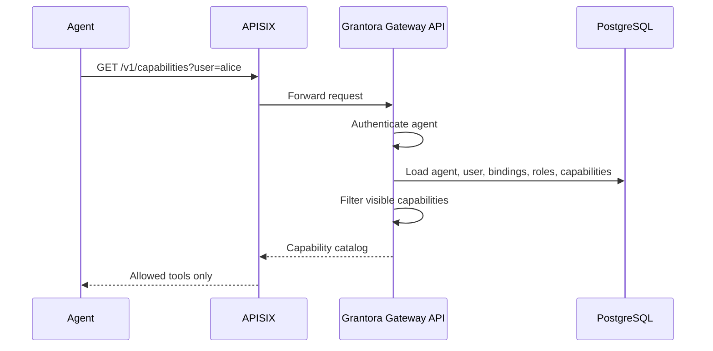
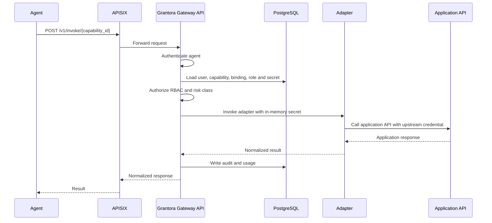

# Grantora

Grantora is the standalone Agent Capability Gateway implemented in this repository.

## Project Definition

**Status:** implemented pre-release standalone core  
**Target:** standalone upstream application, later packaged and managed by a NethServer 8 module  
**Core stack:** Apache APISIX, PostgreSQL, standalone Gateway API service, adapter framework  
**Primary consumers:** Hermes Agent and other AI/automation agents  
**Primary providers:** business applications such as NethVoice/NethCTI, WebTop, Nextcloud, Mattermost/Matrix and future NS8 applications

Grantora lets agents discover and invoke curated business capabilities on behalf of users without receiving upstream application secrets or raw API access.

```text
Agent → APISIX → Grantora Gateway API → Adapter → Business Application API
```

Apache APISIX is the HTTP data-plane. PostgreSQL is the source of truth for dynamic Grantora state. The Python Gateway API performs authentication, authorization, secret brokerage, adapter execution, audit, usage accounting and generated tool descriptions.

The standalone application must remain usable outside NS8. A future NS8 module may install, configure, start, backup and expose it, but upstream Grantora must not depend on NS8 internals.

## Problems Solved

Grantora centralizes this chain:

```text
agent identity + user delegation + capability authorization + secret brokerage + adapter execution + audit + usage
```

It prevents these unsafe patterns:

```text
Do not give application API keys directly to agents.
Do not ask users to manually paste upstream API tokens into agents.
Do not let agents use broad admin credentials.
Do not expose raw application APIs without capability-level authorization.
Do not lose the distinction between agent identity and human user identity.
Do not lose auditability of cross-application actions.
```

Agents invoke stable capabilities such as:

```text
nethvoice.phonebook.search
nextcloud.files.search
hubspot.contacts.search
webtop.calendar.list
mattermost.channel.post
```

They do not call arbitrary upstream paths.

## Current Implementation State

The current repository implements the standalone core needed for first pre-release validation:

```text
FastAPI Gateway API
Apache APISIX data-plane integration
PostgreSQL-backed dynamic state
SQLAlchemy model bootstrap during pre-release development
Admin APIs for core dynamic objects
Runtime APIs for agent discovery, invocation, usage, filtered OpenAPI and MCP-compatible HTTP JSON tools
Agent bearer-token authentication
Bootstrap, DB-backed and optional trusted-proxy OIDC admin authentication
Deny-by-default capability authorization
Secret encryption and active-secret resolution
Audit and usage records for runtime attempts
Mock, NethVoice phonebook, Nextcloud files and HubSpot contacts adapters
APISIX route reconciliation from Grantora state
Local compose stack
Production compose example
Unit, integration, e2e, backup/restore and release/security validation paths
```

Detailed contracts live in:

```text
CONTRACTS.md   public API, database, audit, usage, APISIX and error contracts
ADAPTERS.md    adapter interface and provider rules
SECURITY.md    security model, auth, secrets and threat model
OPERATIONS.md  local, production-style and maintenance workflows
TESTING.md     validation matrix
PLAN.md        implementation roadmap and completion criteria
```

## Design Principles

## Standalone First

Grantora must run outside NethServer 8. NS8 packaging is an integration layer, not a fork of the application logic.

The future NS8 module may provide:

```text
container orchestration
state directory management
environment file generation
secrets.env generation or external secret integration
PostgreSQL backup/restore
APISIX/internal routing configuration
NS8 actions
NS8 UI integration
user-domain mapping
module discovery
```

Grantora remains the upstream application.

## APISIX From The Start

APISIX is the HTTP entry point for runtime agent traffic.

Grantora currently generates a narrow runtime route set instead of exposing broad `/v1/*` passthrough through APISIX. The generated public runtime surface is allowlisted:

```text
GET  /v1/me
GET  /v1/capabilities
GET  /v1/capabilities/openapi.json
GET  /v1/openapi.json
POST /v1/invoke/*
GET  /v1/usage/me
GET  /v1/mcp/tools
POST /v1/mcp/call
```

Admin APIs, health endpoints, metrics and framework documentation are not part of the generated public APISIX runtime route. They remain direct/internal operator surfaces unless a deployment explicitly exposes them through its own system policy.

APISIX responsibilities:

```text
HTTP edge gateway
runtime request routing
request IDs
coarse traffic control
coarse rate limiting
gateway metrics
optional coarse auth plugins where useful
```

Grantora Gateway API responsibilities:

```text
workspace resolution
agent authentication
admin authentication
agent-user delegation
capability authorization
RBAC
secret lookup
adapter execution
audit
usage accounting
filtered OpenAPI and MCP-compatible tool descriptions
APISIX desired-state generation
```

APISIX must not become the business authorization engine. Grantora performs final authentication, delegation checks, capability authorization, secret lookup, audit and usage writes.

## PostgreSQL As Source Of Truth

PostgreSQL stores Grantora dynamic state:

```text
workspaces
application instances
capabilities
agents
users
roles
permissions
bindings
secrets metadata
encrypted secrets or external secret references
audit events
usage events
APISIX route desired state
APISIX sync status
admin credentials
```

APISIX may use its own runtime configuration backend such as etcd, but PostgreSQL remains Grantora's source of truth. The reconciler writes Grantora-managed APISIX routes, plugins and upstreams into APISIX.

During pre-release development, schema changes are applied directly to SQLAlchemy models and created with `Base.metadata.create_all()` on clean disposable state. A real production release requires a separate versioned migration and upgrade policy.

## Environment-Only Static Configuration

All static runtime configuration comes from environment variables. No required hand-written config file should be mounted into the Gateway API service.

Examples:

```text
DATABASE_URL
APISIX_ADMIN_URL
APISIX_ADMIN_KEY
SECRET_ENCRYPTION_KEY
GRANTORA_AGENT_TOKEN_PEPPER
GRANTORA_ADMIN_BOOTSTRAP_TOKEN_HASH
GRANTORA_PUBLIC_BASE_URL
LOG_LEVEL
METRICS_ENABLED
```

Dynamic business configuration is stored in PostgreSQL and managed through Admin APIs.

## Authentication State

## Currently Supported

Runtime agents authenticate with bearer tokens. Grantora stores only `hmac-sha256:<hex>` token hashes computed with the configured token pepper. Plaintext agent tokens are returned only once when created or rotated. Disabled or revoked agents are rejected immediately.

Runtime user selection is not user login. The agent supplies a user external id through the runtime endpoint contract. Grantora resolves that user inside the authenticated agent's workspace and then checks active workspace, active agent, active user, active capability, active binding, active role and required permissions. No binding means no access.

Admin authentication currently supports three forms:

```text
bootstrap bearer token verified against GRANTORA_ADMIN_BOOTSTRAP_TOKEN_HASH
DB-backed admin bearer credentials with optional workspace scope
optional trusted-proxy OIDC/header admin identity when FEATURE_OIDC=true
```

Bootstrap and global DB-backed admin credentials are super-admin credentials. Workspace-scoped admin credentials can manage only their workspace. Optional OIDC/header admin identity is disabled by default and is accepted only when the request source matches `OIDC_TRUSTED_PROXY_CIDRS` and the subject is explicitly allowlisted.

Upstream application authentication is brokered by Grantora. Secrets are encrypted before storage, decrypted only in memory during invocation, and passed only to adapters or controlled broker code. Agents never receive upstream secrets.

External secret references may be stored, but they fail closed unless an external secret backend is explicitly configured.

## Future Authentication Scope

Future work may add:

```text
user SSO through OIDC or LDAP-backed identity sync
user consent and delegated-session lifecycle
OAuth/OIDC delegated upstream credentials
external secret backends such as OpenBao, Vault-compatible APIs, Passbolt or NS8 secret integration
optional JWT/mTLS between internal components
policy backend integration such as OpenFGA, Cerbos or OPA
```

These additions must preserve the same core rule: Grantora remains the business authorization point and agents do not receive upstream reusable credentials.

## Runtime Request Flow

Capability discovery:



Capability invocation:



## Capability Model

A capability is a stable tool/action exposed to agents.

Minimum capability fields:

```yaml
capability:
  id: nethvoice.phonebook.search
  workspace_id: uuid
  application_instance_id: uuid
  name: Search phonebook
  version: 1
  provider_type: nethvoice
  adapter: nethvoice
  operation: phonebook.search
  auth_mode: user
  risk_class: read_only
  input_schema: {}
  output_schema: {}
  status: active
```

Supported auth modes:

```text
system        no human user required; workspace-owned secret
user          must execute on behalf of a human user; user-owned secret
user+scope    user-scoped and scope-constrained; currently treated as user secret lookup
admin         administrative capability; not available to runtime agents
```

Supported risk classes:

```text
read_only      reads data only
draft          creates non-final artifacts
side_effect    sends messages, starts calls or writes data
destructive    deletes or overwrites data
admin          changes configuration or security
```

Runtime invocation requires `capability.describe` and the permission mapped to the capability risk class. Runtime agents cannot invoke `admin` risk capabilities in the current contract.

## Adapter Model

Adapters translate Grantora capability contracts into provider-specific API calls.

Current built-in adapters:

```text
mock
nethvoice.phonebook.search
nextcloud.files.search
```

Adapters must:

```text
receive already-authorized invocation context
receive already-resolved SecretMaterial
validate provider operation support
use configured upstream timeout and TLS verification
bound upstream response size
map upstream errors to safe Grantora errors
normalize successful responses to the capability output schema
drop upstream-only fields by default
avoid logging secrets, authorization headers, cookies or raw payloads
```

## APISIX Integration Contract

Grantora stores desired APISIX route state in PostgreSQL and reconciles it into APISIX. Grantora-managed routes are labeled so stale managed routes can be removed while foreign APISIX routes are left untouched.

Current generated default runtime route:

```yaml
id: gateway-runtime
name: Grantora runtime API
uris:
  - /v1/me
  - /v1/capabilities
  - /v1/capabilities/openapi.json
  - /v1/openapi.json
  - /v1/invoke/*
  - /v1/usage/me
  - /v1/mcp/tools
  - /v1/mcp/call
upstream:
  type: roundrobin
  nodes:
    grantora-api:8080: 1
plugins:
  prometheus: {}
  request-id: {}
  limit-count:
    count: 1000
    time_window: 60
    rejected_code: 429
labels:
  grantora_managed: "true"
  grantora_route_id: gateway-runtime
```

Reconciliation rules:

```text
PostgreSQL desired state wins.
APISIX config is generated runtime state.
Manual changes to Grantora-managed APISIX routes may be overwritten.
Foreign APISIX routes are not touched.
Unsafe sync failures must leave existing safe routes in place.
```

## Deployment-Owned Edge Controls

Grantora owns application-level authentication, authorization, capability filtering, adapter execution, audit, usage and generated APISIX runtime routes.

The deployment platform owns outer edge policy. In NS8 deployments this is expected to be handled by NS8 or the surrounding system, not by the standalone Grantora application code:

```text
TLS profile and certificate lifecycle
host firewall and network-zone policy
IP allowlists or mTLS for admin/operator paths
external reverse-proxy exposure rules
explicit public/private route exposure matrix
operator access to direct Grantora API, health and metrics endpoints
backup scheduling and off-host backup storage
```

Grantora provides safe defaults and documentation for expected exposure, but the system packaging layer must enforce which ports, hostnames and paths are reachable from public, private and operator networks.

Recommended exposure intent:

```text
Public agent network:
  APISIX runtime routes only

Private/operator network:
  direct Grantora admin API
  direct health/readiness checks
  metrics scraping
  APISIX Admin API
  PostgreSQL maintenance access

Never public:
  PostgreSQL
  APISIX Admin API
  plaintext secret material
  container internal service ports unless explicitly protected by system policy
```

## Observability

Grantora records:

```text
structured JSON logs
Prometheus-compatible metrics
audit events in PostgreSQL
usage events in PostgreSQL
optional OpenTelemetry traces
APISIX sync status
```

Logs, metrics and traces must not include tokens, authorization headers, cookies, decrypted secrets, encrypted secret values, raw request payloads, raw upstream response bodies, contact payloads, file contents or message bodies by default.

## Scope

## Current Standalone Core

```text
APISIX data-plane
Gateway API service
PostgreSQL dynamic state
SQLAlchemy schema bootstrap for pre-release development
agent authentication
admin authentication
workspace model
application instance model
capability registry
RBAC and binding model
secret storage/use
capability invocation
audit logging
usage logging
Prometheus-compatible metrics
filtered OpenAPI
MCP-compatible HTTP JSON tool surface
mock adapter
NethVoice phonebook adapter
Nextcloud files adapter
HubSpot contacts adapter
local compose setup
production compose example
```

## Out Of Scope For Current Standalone Core

```text
full NS8 module packaging
full admin UI
all application adapters
user SSO and user consent UI
complex ABAC engine
billing
multi-company SaaS control plane
cross-workspace federation
RAG/search engine
versioned production database migrations
```

## Future Scope

```text
NS8 module packaging
admin UI
user consent UI
OIDC/LDAP user identity integration
external secret backend
quota enforcement
additional provider adapters
policy backend integration
adapter marketplace
RAG/search integration
APISIX direct-proxy execution mode for carefully constrained simple capabilities
```

## Anti-Patterns To Avoid

```text
Do not expose a generic /proxy/{application}/{path} endpoint to agents.
Do not give application API keys to agents.
Do not store raw user passwords.
Do not let APISIX become the business policy engine.
Do not store static configuration in hand-edited YAML files.
Do not make the upstream application depend on NS8-specific paths or commands.
Do not log secrets, authorization headers or full sensitive payloads.
Do not implement all adapters before proving each end-to-end capability flow.
```

## Final Definition

Grantora is a standalone capability broker for agents.

It uses APISIX as HTTP data-plane from the start, PostgreSQL as the source of truth, and environment variables for all static configuration.

It authenticates agents, authorizes them to act on behalf of users, exposes only allowed capabilities, stores and uses upstream application credentials without revealing them to agents, adapts requests to business application APIs, enforces RBAC, records audit and usage, and generates machine-readable API/tool contracts.

The later NethServer 8 module should package and manage this upstream application, not replace it.
