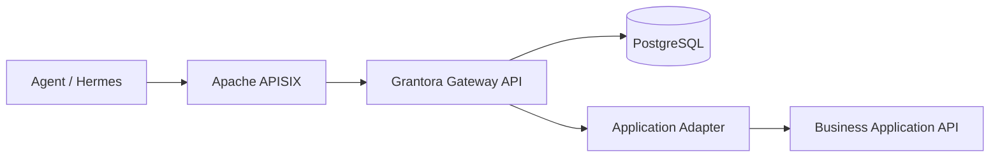

# Grantora

Grantora is a standalone capability gateway for agents. It lets agents discover and invoke curated business capabilities on behalf of users without receiving upstream application secrets or raw API access.

Grantora uses Apache APISIX as the HTTP data-plane, PostgreSQL as the source of truth, and a Python Gateway API for authentication, authorization, secret brokerage, adapter execution, audit, usage accounting and generated tool descriptions.



## Run Locally

```bash
cp .env.example .env
docker compose up --build
```

The compose file starts `grantora-api`, `postgres`, `apisix` and `apisix-etcd`. The API container runs the FastAPI app factory from `src/grantora/main.py`.

Useful local URLs:

- Grantora API: `http://localhost:8080/healthz`
- APISIX public entrypoint: `http://localhost:9080`
- APISIX Admin API: `http://localhost:9180`

## Main References

- [PROJECT.md](PROJECT.md): stable product definition and architecture
- [STRUCTURE.md](STRUCTURE.md): repository and module layout
- [AGENTS.md](AGENTS.md): rules for coding agents
- [PLAN.md](PLAN.md): current implementation roadmap

## Development Status

Status: Milestone 7 observability and hardening implemented. See [PLAN.md](PLAN.md) for the current roadmap status.