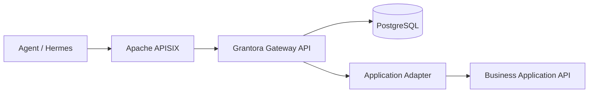

# Grantora

Grantora is a standalone capability gateway for agents. It lets agents discover and invoke curated business capabilities on behalf of users without receiving upstream application secrets or raw API access.

Grantora uses Apache APISIX as the HTTP data-plane, PostgreSQL as the source of truth, and a Python Gateway API for authentication, authorization, secret brokerage, adapter execution, audit, usage accounting and generated tool descriptions.



## Run Locally

```bash
cp .env.example .env
# Edit .env with a generated SECRET_ENCRYPTION_KEY, token pepper,
# ADMIN_BOOTSTRAP_TOKEN and matching GRANTORA_ADMIN_BOOTSTRAP_TOKEN_HASH.
docker compose up --build -d
make demo-seed
make smoke
```

The compose file starts `grantora-api`, `postgres`, `apisix` and `apisix-etcd`. When `MIGRATIONS_AUTO_RUN=true`, the API container runs Alembic migrations before starting the FastAPI app factory from `src/grantora/main.py`.

`make demo-seed` uses only supported Admin APIs to create or reuse a demo workspace, mock application, user, capability, role, binding, secret and agent. It writes the one-time agent token and demo ids to `.grantora-demo.env`, which is ignored by git. `make smoke` loads `.env` and `.grantora-demo.env`, checks health and readiness, syncs APISIX, discovers the demo capability through APISIX and invokes the mock phonebook capability.

Test tiers:

```bash
make test-unit
make test-integration
make test-e2e
```

Integration and e2e tests skip external infrastructure checks unless the documented `GRANTORA_INTEGRATION_*` or `GRANTORA_RUN_E2E=1` environment variables are set. Provider adapter integration tests use mock `httpx` transports and do not contact real upstream services.

Supported real provider templates currently include `nethvoice.phonebook.search` and `nextcloud.files.search`. Admins can list templates with `GET /v1/admin/capability-templates` and create a capability with `POST /v1/admin/capabilities/from-template`.

## Agent Tooling

Agents can use either filtered OpenAPI or Grantora's MCP-compatible HTTP JSON surface through APISIX. The MCP surface is authenticated with the same agent bearer token and is scoped to the selected user.

After `make demo-seed`, use the generated demo token to list tools and call one tool:

```bash
source .grantora-demo.env

curl -sS 'http://localhost:9080/v1/mcp/tools?user=alice' \
    -H "Authorization: Bearer $DEMO_AGENT_TOKEN"

curl -sS -X POST http://localhost:9080/v1/mcp/call \
    -H "Authorization: Bearer $DEMO_AGENT_TOKEN" \
    -H 'Content-Type: application/json' \
    -d '{"user":"alice","name":"mock_phonebook_search","arguments":{"query":"Mario","limit":5}}'
```

`/v1/mcp/tools` and `/v1/capabilities/openapi.json` are generated from the same filtered capability set, so Hermes and other clients only see tools the agent can describe and invoke for that user.

Useful local URLs:

- Grantora API: `http://localhost:8080/healthz`
- APISIX public entrypoint: `http://localhost:9080`
- APISIX Admin API: `http://localhost:9180` bound to localhost by local compose

For deployments where APISIX terminates TLS, set `GRANTORA_PUBLIC_BASE_URL` to the external HTTPS URL. Generated runtime and capability OpenAPI documents advertise that URL in `servers`, while public APISIX routes expose runtime endpoints only and leave `/v1/admin/*` on the direct Grantora API.

## Main References

- [PROJECT.md](PROJECT.md): stable product definition and architecture
- [STRUCTURE.md](STRUCTURE.md): repository and module layout
- [AGENTS.md](AGENTS.md): rules for coding agents
- [PLAN.md](PLAN.md): current implementation roadmap

## Development Status

Status: Milestone 14 APISIX production data-plane implemented. See [PLAN.md](PLAN.md) for the current roadmap status.