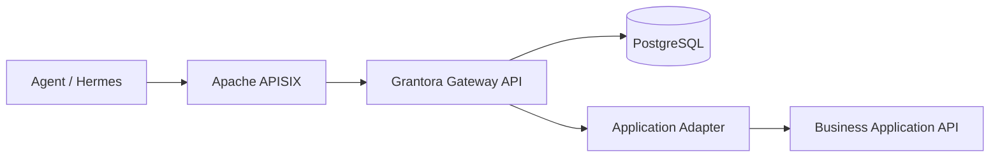

# Grantora

Grantora is a standalone capability gateway for agents. It lets agents discover and invoke curated business capabilities on behalf of users without receiving upstream application secrets or raw API access.

Grantora uses Apache APISIX as the HTTP data-plane, PostgreSQL as the source of truth, and a Python Gateway API for authentication, authorization, secret brokerage, adapter execution, audit, usage accounting and generated tool descriptions.



## Run Locally

Copy the example environment and generate real secret material before starting containers:

```bash
cp .env.example .env
python - <<'PY'
import base64
import hashlib
import hmac
import os
import secrets

admin_token = "grantora-admin-" + secrets.token_urlsafe(24)
pepper = secrets.token_urlsafe(24)
digest = hmac.new(pepper.encode(), admin_token.encode(), hashlib.sha256).hexdigest()
fernet_key = base64.urlsafe_b64encode(os.urandom(32)).decode()

print(f"SECRET_ENCRYPTION_KEY={fernet_key}")
print(f"GRANTORA_AGENT_TOKEN_PEPPER={pepper}")
print(f"ADMIN_BOOTSTRAP_TOKEN={admin_token}")
print(f"GRANTORA_ADMIN_BOOTSTRAP_TOKEN_HASH=hmac-sha256:{digest}")
PY
# Copy the four generated values into .env.
```

Start the local stack with either Docker Compose or Podman Compose:

```bash
# Docker
docker compose up --build -d

# Podman (requires a compose provider such as podman-compose)
podman compose up --build -d
```

The compose files read the canonical `GRANTORA_*` security variables directly. Set `GRANTORA_AGENT_TOKEN_PEPPER` and `GRANTORA_ADMIN_BOOTSTRAP_TOKEN_HASH` in `.env`; do not rely on legacy alias names such as `AGENT_TOKEN_PEPPER`, `TOKEN_HASH_PEPPER`, or `ADMIN_BOOTSTRAP_TOKEN_HASH` when launching the compose stack.

Then seed the demo and run the documented smoke path:

```bash
make demo-seed
make smoke
make retention RETENTION_FLAGS=--dry-run
```

`make demo-seed`, `make smoke`, and the other Python-based make targets run on the host checkout, so they require Python 3.12+ and the project dependencies installed locally. On a container-only Podman host, run the same workflow from the built image on the compose network instead:

```bash
podman run --rm --network grantora \
  --env-file .env \
  -e GRANTORA_API_URL=http://grantora-api:8080 \
  -e GRANTORA_RUNTIME_URL=http://apisix:9080 \
  -e APISIX_PUBLIC_URL=http://apisix:9080 \
  -v "$PWD:/work:Z" \
  -w /work \
  --entrypoint python \
  localhost/grantora-run_grantora-api:latest -m grantora.cli.demo_seed

podman run --rm --network grantora \
  --env-file .env \
  --env-file .grantora-demo.env \
  -e GRANTORA_API_URL=http://grantora-api:8080 \
  -e GRANTORA_RUNTIME_URL=http://apisix:9080 \
  -e APISIX_PUBLIC_URL=http://apisix:9080 \
  -v "$PWD:/work:Z" \
  -w /work \
  --entrypoint python \
  localhost/grantora-run_grantora-api:latest -m grantora.cli.smoke
```

The compose file starts `grantora-api`, `postgres`, `apisix` and `apisix-etcd`. During development, the FastAPI startup path creates the current database schema from SQLAlchemy metadata, so a clean PostgreSQL volume needs no manual database command before `make demo-seed`.

`make demo-seed` uses only supported Admin APIs to create or reuse a demo workspace, mock application, user, capability, role, binding, secret and agent. It writes the one-time agent token and demo ids to `.grantora-demo.env`, which is ignored by git. `make smoke` loads `.env` and `.grantora-demo.env`, checks health and readiness, syncs APISIX, discovers the demo capability through APISIX, invokes the mock phonebook capability, verifies filtered OpenAPI, lists MCP-compatible tools and calls the MCP bridge.

Test tiers:

```bash
make test-unit
make test-integration
make test-e2e
make backup-restore-smoke
make lint
make format-check
make security-scan
make sbom
make container-scan IMAGE=grantora-api:security
make release-image
make release-image-smoke
```

Integration and e2e tests skip external infrastructure checks unless the documented `GRANTORA_INTEGRATION_*`, `GRANTORA_RUN_E2E=1`, or `GRANTORA_RUN_BACKUP_RESTORE_SMOKE=1` environment variables are set. Provider adapter integration tests use mock `httpx` transports and do not contact real upstream services.

## Product Acceptance

Milestone 18 acceptance is executable from the documented operator path. With local compose running and `ADMIN_BOOTSTRAP_TOKEN` available, `make test-e2e` seeds a unique workspace through supported Admin APIs, runs the documented seed and smoke workflow through APISIX, verifies filtered capability OpenAPI and MCP tool discovery, exercises denial/audit/usage paths, and covers admin list, disable, rotate and revoke operations.

Backup and restore acceptance is covered by `make backup-restore-smoke` against disposable compose state. Release security evidence is produced by `make security-scan`, `make sbom`, `make container-scan IMAGE=<candidate-image>` and `make release-image-smoke`; the scenario-to-evidence matrix is maintained in [TESTING.md](TESTING.md).

## Operations

Retention is managed with `make retention`. Use `RETENTION_FLAGS=--dry-run` first to inspect how many audit and usage rows would be pruned before deleting old records.

Tracing is optional and disabled by default. Set `OTEL_TRACING_ENABLED=true`, keep `OTEL_SERVICE_NAME=grantora` or a deployment-specific value, and optionally point `OTEL_EXPORTER_OTLP_ENDPOINT` at an OTLP/HTTP collector. Grantora only records safe identifiers such as request ids, status codes and workspace or capability ids; it does not emit tokens, authorization headers or request payloads into spans.

`make backup-restore-smoke` exercises the documented PostgreSQL dump and restore path, then reruns APISIX sync and a demo invocation. The opt-in pytest equivalent is gated behind `GRANTORA_RUN_BACKUP_RESTORE_SMOKE=1` because it tears down local compose volumes.

Supported real provider templates currently include `nethvoice.phonebook.search` and `nextcloud.files.search`. Admins can list templates with `GET /v1/admin/capability-templates` and create a capability with `POST /v1/admin/capabilities/from-template`.

Security hardening is enabled by default: request bodies are bounded by `MAX_REQUEST_BODY_BYTES`, application base URLs are constrained to safe origins, raw upstream passthrough capabilities are rejected, and admin tokens can be DB-backed and workspace-scoped. Optional OIDC/NS8 admin identity is disabled unless `FEATURE_OIDC=true`, the subject is allowlisted, and the request comes from `OIDC_TRUSTED_PROXY_CIDRS`.

Release security gates write artifacts under `dist/security/`: dependency audit JSON, CycloneDX SBOM and container vulnerability JSON. `make container-scan IMAGE=grantora-api:security` requires Trivy and fails on high or critical findings.

The `Tests` workflow runs `make lint`, `make format-check` and `make test-unit` on pull requests and pushes to `main`. Its PostgreSQL integration and compose-backed e2e jobs are manual `workflow_dispatch` options so infrastructure-heavy checks stay explicit.

Release packaging uses versioned Grantora API container images. `make release-image` builds `ghcr.io/grantora/grantora-api:<version>` from `pyproject.toml`, and `make release-image-smoke` starts that image against a disposable SQLite database and checks that `/healthz` reports the same version. The tag-driven `Release Image` workflow performs the same clean image smoke before pushing versioned and SHA tags to GHCR.

Production deployment examples live under [deploy/](deploy/), starting with [deploy/compose.production.yml](deploy/compose.production.yml). The production compose file publishes only APISIX and keeps PostgreSQL and the APISIX Admin API off host ports. See [docs/release.md](docs/release.md) for the release checklist and upgrade procedure, and [docs/ns8-packaging.md](docs/ns8-packaging.md) for future NS8 module boundaries.

## Agent Tooling

Agents can use either filtered OpenAPI or Grantora's MCP-compatible HTTP JSON surface through APISIX. The MCP surface is authenticated with the same agent bearer token and is scoped to the selected user.

After `make demo-seed`, use the generated demo token to list tools and call one tool:

```bash
source .grantora-demo.env

curl -sS 'http://localhost:9080/v1/mcp/tools?user=alice' \
    -H "Authorization: Bearer $DEMO_AGENT_TOKEN"

curl -sS -X POST http://localhost:9080/v1/mcp/call \
    -H "Authorization: Bearer $DEMO_AGENT_TOKEN" \
    -H 'Content-Type: application/json' \
    -d '{"user":"alice","name":"mock_phonebook_search","arguments":{"query":"Mario","limit":5}}'
```

`/v1/mcp/tools` and `/v1/capabilities/openapi.json` are generated from the same filtered capability set, so Hermes and other clients only see tools the agent can describe and invoke for that user.

Useful local URLs:

- Grantora API: `http://localhost:8080/healthz`
- APISIX public entrypoint: `http://localhost:9080`
- APISIX Admin API: `http://localhost:9180` bound to localhost by local compose

For deployments where APISIX terminates TLS, set `GRANTORA_PUBLIC_BASE_URL` to the external HTTPS URL. Generated runtime and capability OpenAPI documents advertise that URL in `servers`, while public APISIX routes expose runtime endpoints only and leave `/v1/admin/*` on the direct Grantora API.

## Main References

- [PROJECT.md](PROJECT.md): stable product definition and architecture
- [STRUCTURE.md](STRUCTURE.md): repository and module layout
- [AGENTS.md](AGENTS.md): rules for coding agents
- [PLAN.md](PLAN.md): current implementation roadmap

## Development Status

Status: Milestone 18 product completion acceptance implemented. See [PLAN.md](PLAN.md) for the current roadmap status.