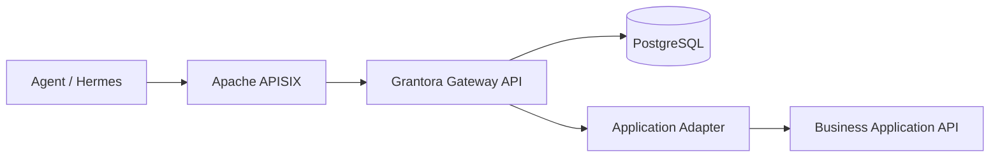

# Grantora

Grantora is a standalone capability gateway for agents. It lets agents discover and invoke curated business capabilities on behalf of users without receiving upstream application secrets or raw API access.

Grantora uses Apache APISIX as the HTTP data-plane, PostgreSQL as the source of truth, and a Python Gateway API for authentication, authorization, secret brokerage, adapter execution, audit, usage accounting and generated tool descriptions.



## Run Locally

```bash
cp .env.example .env
# Edit .env with a generated SECRET_ENCRYPTION_KEY, token pepper,
# ADMIN_BOOTSTRAP_TOKEN and matching GRANTORA_ADMIN_BOOTSTRAP_TOKEN_HASH.
docker compose up --build -d
make demo-seed
make smoke
```

The compose file starts `grantora-api`, `postgres`, `apisix` and `apisix-etcd`. When `MIGRATIONS_AUTO_RUN=true`, the API container runs Alembic migrations before starting the FastAPI app factory from `src/grantora/main.py`.

`make demo-seed` uses only supported Admin APIs to create or reuse a demo workspace, mock application, user, capability, role, binding, secret and agent. It writes the one-time agent token and demo ids to `.grantora-demo.env`, which is ignored by git. `make smoke` loads `.env` and `.grantora-demo.env`, checks health and readiness, syncs APISIX, discovers the demo capability through APISIX and invokes the mock phonebook capability.

Useful local URLs:

- Grantora API: `http://localhost:8080/healthz`
- APISIX public entrypoint: `http://localhost:9080`
- APISIX Admin API: `http://localhost:9180`

## Main References

- [PROJECT.md](PROJECT.md): stable product definition and architecture
- [STRUCTURE.md](STRUCTURE.md): repository and module layout
- [AGENTS.md](AGENTS.md): rules for coding agents
- [PLAN.md](PLAN.md): current implementation roadmap

## Development Status

Status: Milestone 10 bootstrap, seeding and human workflow implemented. See [PLAN.md](PLAN.md) for the current roadmap status.